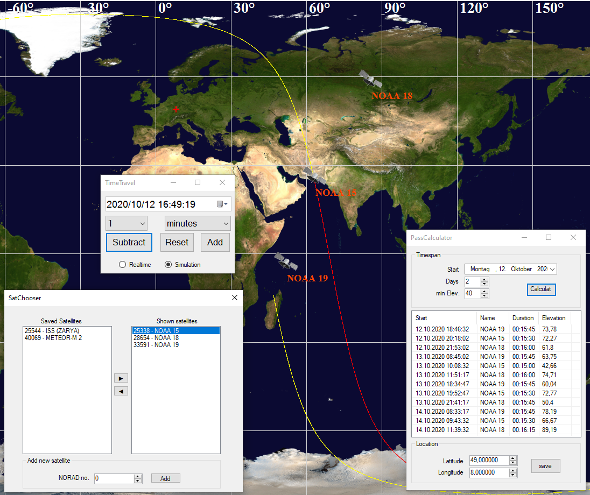

<h1 align="center">
   
  
</h1>

<h4 align="center">A small satellite tracker and pass calculator built on <a href="https://github.com/1manprojects/one_Sgp4" target="_blank">1manprojects'</a> library - inspired by <a href="http://www.stoff.pl/" target="_blank">Orbitron</a>.</h4>

  <a href="#key-features">Key Features</a> •
  <a href="#how-to-use">How To Use</a> •
  <a href="#used-technologies">Used Technologies</a> •
  <a href="#open-source">Open Source</a>

<h1 align="center">

</h1>

## Key Features

* Track multiple Satellites at the same time
* Simulates Satellite position at different times
* Pass calculation
* Multi satellite management
* Automatic TLE data updating
* Open Source - everybody can contribute
  
  
## How To Use

You can [download](https://github.com/JKamue/SatWatcher/releases) the latest version of SatWatcher.
1. Adding satellites

    You can add satellites in the *select satellites* menu. Just enter the unique <a href="https://de.wikipedia.org/wiki/Satellite_Catalog_Number">NORAD number</a> and click on add.
    The satellites TLE data should be automatically updated whenever the software starts from now on.

1. Tracking satellites
    
    You can select which satellites the program tracks by selecting them in the *select satellites* menu. Just select a satellite and move it into another group with the arrow keys.
    
1. Calculate a list of passes
    
    The *Predict Passes* menu allows you to calculate a list of passes for the current seleciton of satellites. 
    You can set your current location at the bottom of the menu. It should be added to the map as a red cross.
    You can also set the timeframe as well as the minimum elevation at the top of the menu.
    You can also select a displayed pass and the program will automatically simulate the satellite positions at this time.
    
1. Simulate different times

    The *Time Travel* menu allows you to time travel.
    You can switch between realtime and simulated time. When enetering simulated time mode you can edit the time at the top or subtract a set amount of seconds/minutes/hours/days

## Used Technologies

This software was built using

- C# .NET Framework 4.8 [WinForms](https://docs.microsoft.com/de-de/dotnet/desktop/winforms/?view=netframeworkdesktop-4.8)
- [Dapper](https://github.com/StackExchange/Dapper) & [SQLite](https://www.sqlite.org/index.html) as a simple data access layer
- [NORAD TLE Api](https://data.ivanstanojevic.me/api/tle/docs) by [Ivan Stanojević](https://ivanstanojevic.me/)
- [Newtonsoft.Json](https://github.com/JamesNK/Newtonsoft.Json) to decode received TLE data
- And most importantly <a href="https://github.com/1manprojects/one_Sgp4" target="_blank">1manprojects'</a> library

## Open Source

This software is open source. You are encouraged to contribute! Feel free to open an issue if you have any problem or an idea.

 

---
> [JKamue.de](https://www.jkamue.de) &nbsp;&middot;&nbsp;
> Twitter [@JKamue_dev](https://twitter.com/JKamue_dev)
